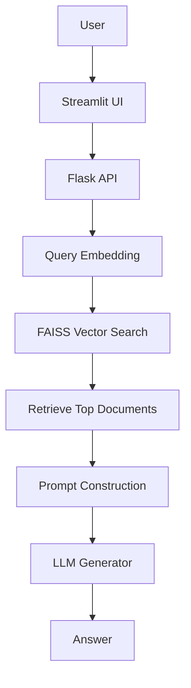
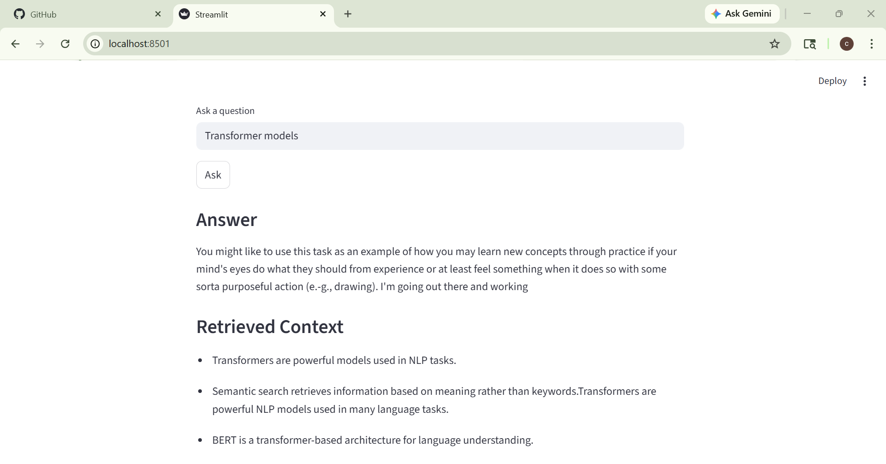
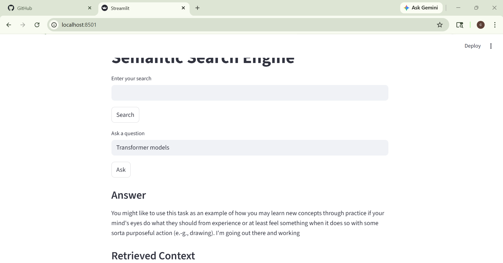

# Semantic Search RAG Chatbot

An end-to-end Retrieval Augmented Generation (RAG) system that performs semantic document search and generates answers using retrieved context.

The project demonstrates how to build a production-style NLP pipeline combining embeddings, vector search, and language generation.

-----------------------------------------------------------

## Overview

Traditional keyword search fails when queries use different wording than the stored documents.

This project solves that problem using semantic embeddings and vector similarity search.

## Workflow

1. Convert documents into embeddings
2. Store embeddings in a vector index
3. Convert user queries into embeddings
4. Retrieve the most similar documents
5. Generate an answer using the retrieved context

## Technologies used:

- Flask - REST API backend
- Streamlit - interactive UI
- FAISS - vector similarity search
- sentence-transformers - embedding generation
- Hugging Face Transformers - text generation model

## Architecture

## Demo

-----------------------------------------------------------
## Key Concepts Demonstrated

This project implements several core NLP and ML system concepts:

### Semantic Embeddings

Text is converted into dense vectors using transformer models.

### Vector Similarity Search

Efficient nearest neighbor retrieval using FAISS .

### Retrieval-Augmented Generation

Combining documen retrieval with LLM generation.

### Prompt Engineering

Structured prompts guide the language model to use retrieved context.

### RESTful ML Services

Building scalable NLP APIs with Flask.

### Interactive AI Interfaces

User interaction via Streamlit
